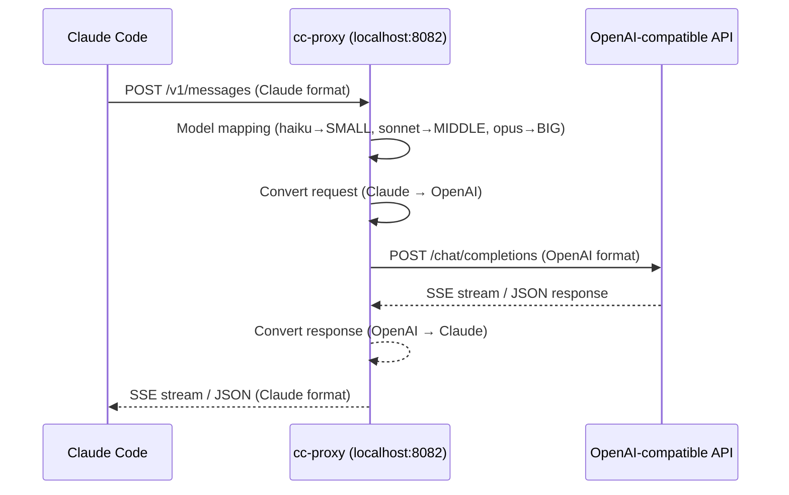

# cc-proxy

[English](README.md) | [简体中文](README.zh-CN.md)

**Use any OpenAI-compatible API with Claude Code.** A single Rust binary that translates Claude API requests into OpenAI Chat Completions format in real-time.

```
Claude Code ──► cc-proxy ──► Any OpenAI-compatible API
               (localhost)    (OpenAI / DeepSeek / Ollama / Azure / ...)
```

## Why cc-proxy?

Claude Code only speaks the Anthropic Messages API. If you want to use GPT-5.4, DeepSeek, Ollama, or any other provider, you need a translation layer. That's cc-proxy — a **6 MB static binary** with zero runtime dependencies.

## Architecture



## Features

- **Single binary** — 6.4 MB, no Python, no Node.js, no Docker
- **Full streaming** — real-time SSE conversion, token-level streaming
- **Tool use** — complete function calling / tool use translation
- **Reasoning mode** — GPT o-series reasoning_effort support (low/medium/high/xhigh)
- **Interactive setup** — `cc-proxy setup` wizard configures everything
- **Daemon mode** — `cc-proxy start -d` runs in background with PID management
- **Auth support** — optional client API key validation via `ANTHROPIC_API_KEY`
- **Custom headers** — inject extra headers via `CUSTOM_HEADER_*` env vars
- **Azure support** — native Azure OpenAI endpoint handling
- **Graceful shutdown** — SIGTERM/SIGINT with connection draining

## Quick Start

### Option 1: Download Binary (Recommended)

Download the latest release for your platform from [GitHub Releases](https://github.com/fengshao1227/cc-proxy/releases):

```bash
# macOS (Apple Silicon)
curl -fsSL https://github.com/fengshao1227/cc-proxy/releases/latest/download/cc-proxy-aarch64-apple-darwin.tar.gz | tar xz
sudo mv cc-proxy /usr/local/bin/

# macOS (Intel)
curl -fsSL https://github.com/fengshao1227/cc-proxy/releases/latest/download/cc-proxy-x86_64-apple-darwin.tar.gz | tar xz
sudo mv cc-proxy /usr/local/bin/

# Linux (x86_64)
curl -fsSL https://github.com/fengshao1227/cc-proxy/releases/latest/download/cc-proxy-x86_64-unknown-linux-musl.tar.gz | tar xz
sudo mv cc-proxy /usr/local/bin/
```

Then run the setup wizard:

```bash
cc-proxy setup
```

### Option 2: Build from Source

```bash
git clone https://github.com/fengshao1227/cc-proxy.git
cd cc-proxy
cargo build --release
# Binary at target/release/cc-proxy
```

### Connect Claude Code

Once cc-proxy is running, configure Claude Code to point at it:

```bash
export ANTHROPIC_BASE_URL=http://localhost:8082
export ANTHROPIC_API_KEY=your-auth-key  # must match cc-proxy's ANTHROPIC_API_KEY if set

claude   # launch Claude Code as usual
```

## CLI Commands

| Command | Description |
|---------|-------------|
| `cc-proxy setup` | Interactive configuration wizard — select provider, models, port |
| `cc-proxy start` | Start the proxy server in foreground |
| `cc-proxy start -d` | Start as background daemon (PID stored in `~/.cc-proxy/proxy.pid`) |
| `cc-proxy stop` | Stop the background daemon |
| `cc-proxy status` | Show current configuration and running state |
| `cc-proxy test` | Test connection to upstream API |

### Setup Wizard

```
$ cc-proxy setup

  ╔══════════════════════════════════════╗
  ║       cc-proxy 交互式配置向导       ║
  ╚══════════════════════════════════════╝

  选择 API 提供商:
  > OpenAI
    DeepSeek
    Ollama (本地)
    Azure OpenAI
    自定义 (Custom)
```

The wizard saves configuration to `~/.cc-proxy/config.json` (owner-only permissions, `0600`).

## Configuration

cc-proxy loads configuration with the following priority:

**`~/.cc-proxy/config.json`** > **environment variables / `.env`** > **defaults**

### Environment Variables

| Variable | Default | Description |
|----------|---------|-------------|
| `OPENAI_API_KEY` | *(required)* | API key for the upstream provider |
| `OPENAI_BASE_URL` | `https://api.openai.com/v1` | Base URL of the OpenAI-compatible API |
| `BIG_MODEL` | `gpt-4o` | Model mapped from Claude Opus |
| `MIDDLE_MODEL` | *(falls back to BIG_MODEL)* | Model mapped from Claude Sonnet |
| `SMALL_MODEL` | `gpt-4o-mini` | Model mapped from Claude Haiku |
| `HOST` | `0.0.0.0` | Server listen address |
| `PORT` | `8082` | Server listen port |
| `ANTHROPIC_API_KEY` | *(none)* | If set, clients must provide this key to authenticate |
| `AZURE_API_VERSION` | *(none)* | Azure OpenAI API version (e.g. `2024-12-01-preview`) |
| `LOG_LEVEL` | `info` | Logging level (`debug`, `info`, `warn`, `error`) |
| `MAX_TOKENS_LIMIT` | `4096` | Maximum tokens per response |
| `MIN_TOKENS_LIMIT` | `100` | Minimum tokens floor |
| `REQUEST_TIMEOUT` | `90` | Upstream request timeout in seconds |
| `REASONING_EFFORT` | `none` | Global reasoning effort level (see below) |
| `CUSTOM_HEADER_*` | *(none)* | Custom headers injected into upstream requests |

### Custom Headers

Prefix any environment variable with `CUSTOM_HEADER_` and the suffix becomes the header name (underscores converted to hyphens):

```bash
CUSTOM_HEADER_X_MY_TRACE_ID=abc123
# → sends header: x-my-trace-id: abc123
```

Blocked headers (cannot be overridden): `host`, `authorization`, `content-type`, `content-length`, `transfer-encoding`, `connection`.

## Model Mapping

cc-proxy automatically maps Claude model names to your configured models:

| Claude Code requests... | cc-proxy sends... | Config variable |
|-------------------------|-------------------|-----------------|
| `claude-3-opus-*`, `claude-3-5-opus-*` | `BIG_MODEL` | `gpt-4o` |
| `claude-3-sonnet-*`, `claude-3-5-sonnet-*` | `MIDDLE_MODEL` | *(BIG_MODEL)* |
| `claude-3-haiku-*`, `claude-3-5-haiku-*` | `SMALL_MODEL` | `gpt-4o-mini` |
| `claude-*` (other variants) | `BIG_MODEL` | `gpt-4o` |
| Non-Claude models (e.g. `gpt-4o`) | Pass-through | *(as-is)* |

## Reasoning / Thinking Mode

When using models that support extended thinking (GPT o-series, DeepSeek-R1, etc.), cc-proxy translates Claude's `thinking` parameter to OpenAI's `reasoning_effort`.

**Priority chain:**
1. If the Claude request has `thinking: { enabled: true }` — use `REASONING_EFFORT` config value (or `medium` if not set)
2. If `REASONING_EFFORT` is set in config — always apply it
3. If `REASONING_EFFORT` is `none` (default) — no reasoning parameters sent

```bash
# Enable reasoning globally
REASONING_EFFORT=high cc-proxy start

# Levels: none | low | medium | high | xhigh
```

## Provider Examples

### OpenAI

```bash
OPENAI_API_KEY=sk-your-key
OPENAI_BASE_URL=https://api.openai.com/v1
BIG_MODEL=gpt-4o
SMALL_MODEL=gpt-4o-mini
```

### DeepSeek

```bash
OPENAI_API_KEY=sk-your-deepseek-key
OPENAI_BASE_URL=https://api.deepseek.com
BIG_MODEL=deepseek-chat
SMALL_MODEL=deepseek-chat
```

### Ollama (Local)

```bash
OPENAI_API_KEY=ollama           # any non-empty string
OPENAI_BASE_URL=http://localhost:11434/v1
BIG_MODEL=qwen2.5:14b
SMALL_MODEL=qwen2.5:7b
```

### Azure OpenAI

```bash
OPENAI_API_KEY=your-azure-key
OPENAI_BASE_URL=https://your-resource.openai.azure.com/openai/deployments/your-deployment
AZURE_API_VERSION=2024-12-01-preview
BIG_MODEL=gpt-4o
SMALL_MODEL=gpt-4o-mini
```

### OpenRouter

```bash
OPENAI_API_KEY=sk-or-your-key
OPENAI_BASE_URL=https://openrouter.ai/api/v1
BIG_MODEL=openai/gpt-4o
SMALL_MODEL=openai/gpt-4o-mini
```

## API Endpoints

| Endpoint | Method | Description |
|----------|--------|-------------|
| `POST /v1/messages` | POST | Claude Messages API (main proxy endpoint) |
| `POST /v1/messages/count_tokens` | POST | Token count estimation |
| `GET /health` | GET | Health check (no auth required) |
| `GET /test-connection` | GET | Test upstream API connectivity |
| `GET /` | GET | Server info and config summary |

## Project Structure

```
cc-proxy/
├── Cargo.toml                 # Workspace root
├── crates/
│   ├── cc-proxy-core/         # Core library
│   │   └── src/
│   │       ├── config.rs      # Configuration loading (env / .env / JSON)
│   │       ├── server.rs      # Axum HTTP server & route handlers
│   │       ├── client.rs      # Upstream HTTP client with SSE parsing
│   │       ├── model_map.rs   # Claude → OpenAI model name mapping
│   │       ├── auth.rs        # API key authentication middleware
│   │       ├── error.rs       # Error types with upstream classification
│   │       ├── convert/
│   │       │   ├── request.rs # Claude → OpenAI request conversion
│   │       │   ├── response.rs# OpenAI → Claude response conversion
│   │       │   └── stream.rs  # SSE streaming state machine converter
│   │       └── types/
│   │           ├── claude.rs  # Claude API type definitions
│   │           └── openai.rs  # OpenAI API type definitions
│   └── cc-proxy-cli/          # CLI binary
│       └── src/
│           ├── main.rs        # CLI entry point (clap)
│           ├── daemon.rs      # Background daemon management
│           └── commands/      # setup, start, stop, status, test
└── .env.example               # Example configuration
```

## Security

- API keys are redacted in logs and debug output (`[REDACTED]`)
- Config file at `~/.cc-proxy/config.json` has `0600` permissions (owner-only)
- Config directory has `0700` permissions
- CORS restricted to localhost origins only
- Optional client authentication via `ANTHROPIC_API_KEY`
- Blocked security-sensitive custom headers

## License

[MIT](LICENSE)
