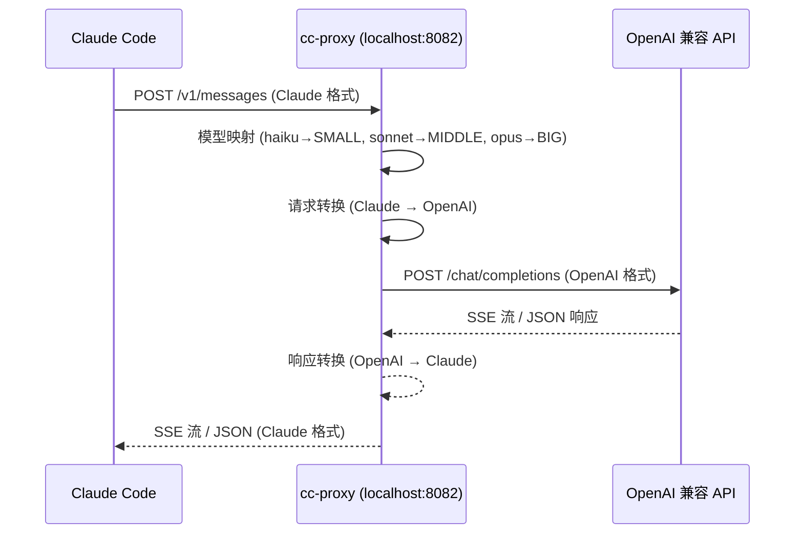

# cc-proxy

[English](README.md) | [简体中文](README.zh-CN.md)

**让 Claude Code 接入任意 OpenAI 兼容 API。** 单个 Rust 二进制文件，实时将 Claude API 请求翻译为 OpenAI Chat Completions 格式。

```
Claude Code ──► cc-proxy ──► 任意 OpenAI 兼容 API
               (localhost)    (DeepSeek / OpenAI / Ollama / Azure / ...)
```

## 为什么需要 cc-proxy？

Claude Code 只支持 Anthropic Messages API。如果你想使用 DeepSeek、GPT-5.4、Ollama 或其他任何模型服务商，就需要一个协议翻译层。cc-proxy 就是这个翻译层 — **6 MB 静态二进制**，零运行时依赖。

## 架构



## 特性

- **单二进制文件** — 6.4 MB，无需 Python、Node.js、Docker
- **完整流式传输** — 实时 SSE 转换，逐 token 流式输出
- **工具调用** — 完整的 function calling / tool use 翻译
- **思考模式** — GPT o 系列 reasoning_effort 支持 (low/medium/high/xhigh)
- **交互式配置** — `cc-proxy setup` 向导一键配置
- **后台守护进程** — `cc-proxy start -d` 后台运行，PID 管理
- **鉴权支持** — 可选的客户端 API Key 验证
- **自定义请求头** — 通过 `CUSTOM_HEADER_*` 环境变量注入额外请求头
- **Azure 支持** — 原生 Azure OpenAI 端点处理
- **优雅停机** — SIGTERM/SIGINT 信号处理，连接排空

## 快速开始

### 方式一：下载预编译二进制（推荐）

从 [GitHub Releases](https://github.com/fengshao1227/cc-proxy/releases) 下载对应平台的二进制文件：

```bash
# macOS (Apple Silicon)
curl -fsSL https://github.com/fengshao1227/cc-proxy/releases/latest/download/cc-proxy-aarch64-apple-darwin.tar.gz | tar xz
sudo mv cc-proxy /usr/local/bin/

# macOS (Intel)
curl -fsSL https://github.com/fengshao1227/cc-proxy/releases/latest/download/cc-proxy-x86_64-apple-darwin.tar.gz | tar xz
sudo mv cc-proxy /usr/local/bin/

# Linux (x86_64)
curl -fsSL https://github.com/fengshao1227/cc-proxy/releases/latest/download/cc-proxy-x86_64-unknown-linux-musl.tar.gz | tar xz
sudo mv cc-proxy /usr/local/bin/
```

运行配置向导：

```bash
cc-proxy setup
```

### 方式二：从源码编译

```bash
git clone https://github.com/fengshao1227/cc-proxy.git
cd cc-proxy
cargo build --release
# 二进制文件位于 target/release/cc-proxy
```

### 连接 Claude Code

cc-proxy 启动后，配置 Claude Code 指向代理：

```bash
export ANTHROPIC_BASE_URL=http://localhost:8082
export ANTHROPIC_API_KEY=your-auth-key  # 如果 cc-proxy 设置了 ANTHROPIC_API_KEY，这里需要匹配

claude   # 正常启动 Claude Code
```

## CLI 命令

| 命令 | 说明 |
|------|------|
| `cc-proxy setup` | 交互式配置向导 — 选择服务商、模型、端口 |
| `cc-proxy start` | 前台启动代理服务 |
| `cc-proxy start -d` | 后台守护进程模式启动（PID 存储在 `~/.cc-proxy/proxy.pid`） |
| `cc-proxy stop` | 停止后台守护进程 |
| `cc-proxy status` | 查看当前配置和运行状态 |
| `cc-proxy test` | 测试上游 API 连通性 |

### 配置向导

```
$ cc-proxy setup

  ╔══════════════════════════════════════╗
  ║       cc-proxy 交互式配置向导       ║
  ╚══════════════════════════════════════╝

  选择 API 提供商:
  > OpenAI
    DeepSeek
    Ollama (本地)
    Azure OpenAI
    自定义 (Custom)
```

向导将配置保存到 `~/.cc-proxy/config.json`（仅所有者可读写，权限 `0600`）。

## 配置

cc-proxy 按以下优先级加载配置：

**`~/.cc-proxy/config.json`** > **环境变量 / `.env` 文件** > **默认值**

### 环境变量

| 变量 | 默认值 | 说明 |
|------|--------|------|
| `OPENAI_API_KEY` | *(必填)* | 上游服务商的 API Key |
| `OPENAI_BASE_URL` | `https://api.openai.com/v1` | OpenAI 兼容 API 的基础 URL |
| `BIG_MODEL` | `gpt-4o` | Claude Opus 映射的模型 |
| `MIDDLE_MODEL` | *(回退到 BIG_MODEL)* | Claude Sonnet 映射的模型 |
| `SMALL_MODEL` | `gpt-4o-mini` | Claude Haiku 映射的模型 |
| `HOST` | `0.0.0.0` | 服务监听地址 |
| `PORT` | `8082` | 服务监听端口 |
| `ANTHROPIC_API_KEY` | *(无)* | 设置后，客户端必须提供此 Key 才能使用代理 |
| `AZURE_API_VERSION` | *(无)* | Azure OpenAI API 版本（如 `2024-12-01-preview`） |
| `LOG_LEVEL` | `info` | 日志级别（`debug`、`info`、`warn`、`error`） |
| `MAX_TOKENS_LIMIT` | `4096` | 单次响应最大 token 数 |
| `MIN_TOKENS_LIMIT` | `100` | 最小 token 数下限 |
| `REQUEST_TIMEOUT` | `90` | 上游请求超时（秒） |
| `REASONING_EFFORT` | `none` | 全局思考模式级别（见下文） |
| `CUSTOM_HEADER_*` | *(无)* | 注入到上游请求的自定义头 |

### 自定义请求头

以 `CUSTOM_HEADER_` 为前缀的环境变量会被注入到上游请求中，后缀转为 header 名称（下划线转连字符）：

```bash
CUSTOM_HEADER_X_MY_TRACE_ID=abc123
# → 发送请求头: x-my-trace-id: abc123
```

被屏蔽的 header（不可覆盖）：`host`、`authorization`、`content-type`、`content-length`、`transfer-encoding`、`connection`。

## 模型映射

cc-proxy 自动将 Claude 模型名称映射到你配置的模型：

| Claude Code 请求的模型 | cc-proxy 实际发送 | 配置变量 |
|----------------------|------------------|---------|
| `claude-3-opus-*`、`claude-3-5-opus-*` | `BIG_MODEL` | `gpt-4o` |
| `claude-3-sonnet-*`、`claude-3-5-sonnet-*` | `MIDDLE_MODEL` | *(BIG_MODEL)* |
| `claude-3-haiku-*`、`claude-3-5-haiku-*` | `SMALL_MODEL` | `gpt-4o-mini` |
| `claude-*`（其他变体） | `BIG_MODEL` | `gpt-4o` |
| 非 Claude 模型（如 `gpt-4o`） | 透传 | *(原样传递)* |

## 思考模式 (Reasoning)

当使用支持扩展思考的模型（GPT o 系列、DeepSeek-R1 等）时，cc-proxy 将 Claude 的 `thinking` 参数翻译为 OpenAI 的 `reasoning_effort`。

**优先级链：**
1. 如果 Claude 请求包含 `thinking: { enabled: true }` — 使用 `REASONING_EFFORT` 配置值（未设置则默认 `medium`）
2. 如果配置了 `REASONING_EFFORT` — 始终应用
3. 如果 `REASONING_EFFORT` 为 `none`（默认） — 不发送 reasoning 参数

```bash
# 全局开启思考模式
REASONING_EFFORT=high cc-proxy start

# 可选级别: none | low | medium | high | xhigh
```

## 服务商配置示例

### DeepSeek（国内推荐）

```bash
OPENAI_API_KEY=sk-your-deepseek-key
OPENAI_BASE_URL=https://api.deepseek.com
BIG_MODEL=deepseek-chat
SMALL_MODEL=deepseek-chat
```

> DeepSeek 是国内可直连、无需代理的优质选择。API 价格极具竞争力，代码能力出色。

### OpenAI

```bash
OPENAI_API_KEY=sk-your-key
OPENAI_BASE_URL=https://api.openai.com/v1
BIG_MODEL=gpt-4o
SMALL_MODEL=gpt-4o-mini
```

### Ollama（本地部署）

```bash
OPENAI_API_KEY=ollama           # 任意非空字符串即可
OPENAI_BASE_URL=http://localhost:11434/v1
BIG_MODEL=qwen2.5:14b
SMALL_MODEL=qwen2.5:7b
```

> 完全离线运行，无需 API Key，适合对数据隐私有严格要求的场景。

### Azure OpenAI

```bash
OPENAI_API_KEY=your-azure-key
OPENAI_BASE_URL=https://your-resource.openai.azure.com/openai/deployments/your-deployment
AZURE_API_VERSION=2024-12-01-preview
BIG_MODEL=gpt-4o
SMALL_MODEL=gpt-4o-mini
```

### 硅基流动 (SiliconFlow)

```bash
OPENAI_API_KEY=sk-your-siliconflow-key
OPENAI_BASE_URL=https://api.siliconflow.cn/v1
BIG_MODEL=deepseek-ai/DeepSeek-V3
SMALL_MODEL=deepseek-ai/DeepSeek-V3
```

### Moonshot (月之暗面)

```bash
OPENAI_API_KEY=sk-your-moonshot-key
OPENAI_BASE_URL=https://api.moonshot.cn/v1
BIG_MODEL=moonshot-v1-128k
SMALL_MODEL=moonshot-v1-8k
```

### 智谱 GLM

```bash
OPENAI_API_KEY=your-zhipu-key
OPENAI_BASE_URL=https://open.bigmodel.cn/api/paas/v4
BIG_MODEL=glm-4-plus
SMALL_MODEL=glm-4-flash
```

### OpenRouter

```bash
OPENAI_API_KEY=sk-or-your-key
OPENAI_BASE_URL=https://openrouter.ai/api/v1
BIG_MODEL=openai/gpt-4o
SMALL_MODEL=openai/gpt-4o-mini
```

> OpenRouter 聚合了数百个模型，可按需切换，适合需要多模型对比的场景。

## API 端点

| 端点 | 方法 | 说明 |
|------|------|------|
| `/v1/messages` | POST | Claude Messages API（主代理端点） |
| `/v1/messages/count_tokens` | POST | Token 数量估算 |
| `/health` | GET | 健康检查（无需鉴权） |
| `/test-connection` | GET | 测试上游 API 连通性 |
| `/` | GET | 服务器信息和配置摘要 |

## 项目结构

```
cc-proxy/
├── Cargo.toml                 # Workspace 根配置
├── crates/
│   ├── cc-proxy-core/         # 核心库
│   │   └── src/
│   │       ├── config.rs      # 配置加载 (env / .env / JSON)
│   │       ├── server.rs      # Axum HTTP 服务器 & 路由处理
│   │       ├── client.rs      # 上游 HTTP 客户端 & SSE 解析
│   │       ├── model_map.rs   # Claude → OpenAI 模型名映射
│   │       ├── auth.rs        # API Key 鉴权中间件
│   │       ├── error.rs       # 错误类型 & 上游错误分类
│   │       ├── convert/
│   │       │   ├── request.rs # Claude → OpenAI 请求转换
│   │       │   ├── response.rs# OpenAI → Claude 响应转换
│   │       │   └── stream.rs  # SSE 流式转换状态机
│   │       └── types/
│   │           ├── claude.rs  # Claude API 类型定义
│   │           └── openai.rs  # OpenAI API 类型定义
│   └── cc-proxy-cli/          # CLI 二进制
│       └── src/
│           ├── main.rs        # CLI 入口 (clap)
│           ├── daemon.rs      # 后台守护进程管理
│           └── commands/      # setup, start, stop, status, test
└── .env.example               # 配置示例
```

## FAQ

### Claude Code 如何安装？

```bash
# 需要 Node.js 18+
npm install -g @anthropic-ai/claude-code
```

### 国内网络无法访问 OpenAI API？

推荐使用以下方案（无需翻墙）：

1. **DeepSeek** — 国产大模型，API 直连，代码能力优秀
2. **硅基流动 (SiliconFlow)** — 国内模型聚合平台，支持多种模型
3. **月之暗面 (Moonshot)** — 国产长上下文模型
4. **智谱 GLM** — 清华系大模型
5. **Ollama** — 本地部署，完全离线

### 启动后 Claude Code 连不上？

检查以下几点：

```bash
# 1. 确认 cc-proxy 正在运行
cc-proxy status

# 2. 测试上游 API 连通性
cc-proxy test

# 3. 确认 Claude Code 环境变量正确
echo $ANTHROPIC_BASE_URL   # 应该是 http://localhost:8082

# 4. 直接测试代理端点
curl http://localhost:8082/health
```

### 如何让 Claude Code 启动时自动连接代理？

将环境变量添加到 shell 配置文件：

```bash
# ~/.bashrc 或 ~/.zshrc
export ANTHROPIC_BASE_URL=http://localhost:8082
export ANTHROPIC_API_KEY=your-auth-key
```

### 支持哪些模型？

任何提供 OpenAI Chat Completions 兼容 API 的模型都可以使用。常见选择：

| 服务商 | 推荐模型 | 网络要求 |
|--------|---------|---------|
| DeepSeek | deepseek-chat | 国内直连 |
| 硅基流动 | deepseek-ai/DeepSeek-V3 | 国内直连 |
| 月之暗面 | moonshot-v1-128k | 国内直连 |
| 智谱 | glm-4-plus | 国内直连 |
| OpenAI | gpt-4o | 需要代理 |
| OpenRouter | 任意模型 | 需要代理 |
| Ollama | qwen2.5:14b | 本地 |

### cc-proxy 和 claude-code-proxy 有什么区别？

cc-proxy 是用 Rust 重写的版本，相比 Node.js/Python 实现：

- **零依赖** — 单个 6.4 MB 二进制文件，无需安装运行时
- **更低内存** — 空闲时约 5 MB，高并发下也远低于 Node.js
- **更高性能** — 原生异步 I/O，SSE 流式零拷贝
- **更安全** — Rust 内存安全保证，密钥自动脱敏

## 安全

- API Key 在日志和调试输出中自动脱敏（`[REDACTED]`）
- 配置文件 `~/.cc-proxy/config.json` 权限为 `0600`（仅所有者可读写）
- 配置目录权限为 `0700`
- CORS 仅允许 localhost 来源
- 可选的客户端鉴权（`ANTHROPIC_API_KEY`）
- 安全敏感的 header 被屏蔽，不可通过自定义头覆盖

## License

[MIT](LICENSE)
